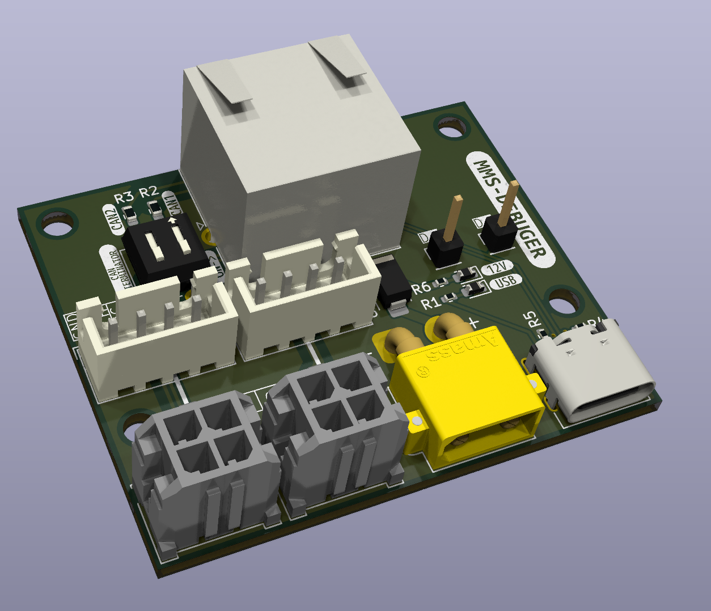

 
## Board  debug for ModualCard system Rj45 connector
### Input
- 12V xt30 connector
- USB-C connector for MMS<-PC communication USB 2.0 compatible
- CAN1 and CAN2 molex microfit 2x2 connectors.
- 2x can termination switches
- Reverse polarity protection
### Output
- Rj45 connector for ModualCard system

### RJ45 Pinout
| Pin | Function | Description |
|-----|----------|---------------------------------------------|
| 1   | CAN1 L   | CAN 1 Low speed up to 1 Mb/s                |
| 2   | CAN1 H   | CAN 1 High speed up to 1 Mb/s               |
| 3   | GND      | 500mA                                       |
| 4   | CAN2 L   | CAN 2 Low speed up to 5 Mb/s                |
| 5   | CAN2 H   | CAN 2 High speed up to 5 Mb/s               |
| 6   | 12V      | 500 mA                                      |
| 7   | USB D-   | USB data plus                               |
| 8   | USB D+   | USB data minus                              |

### Images

